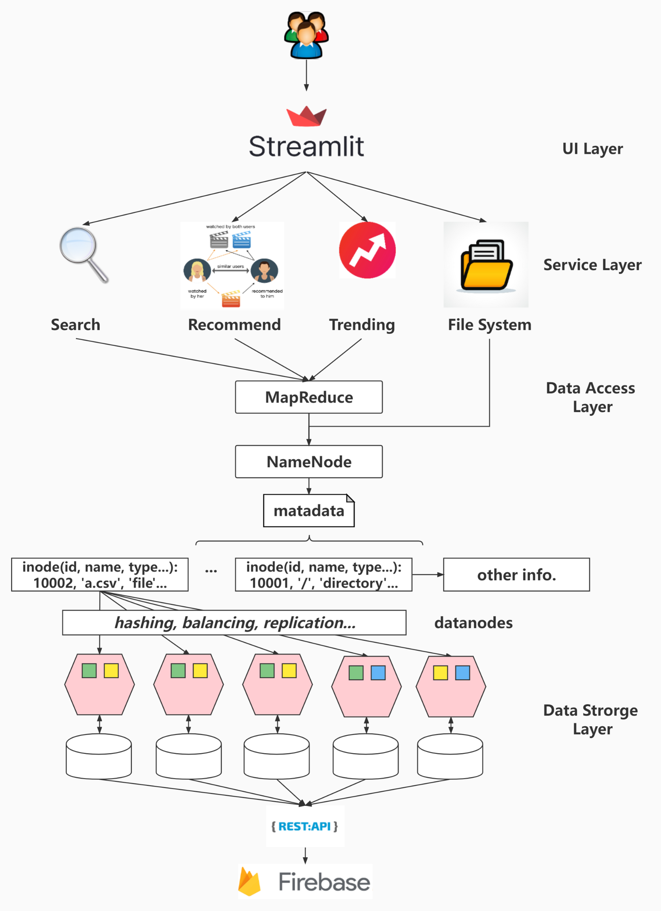
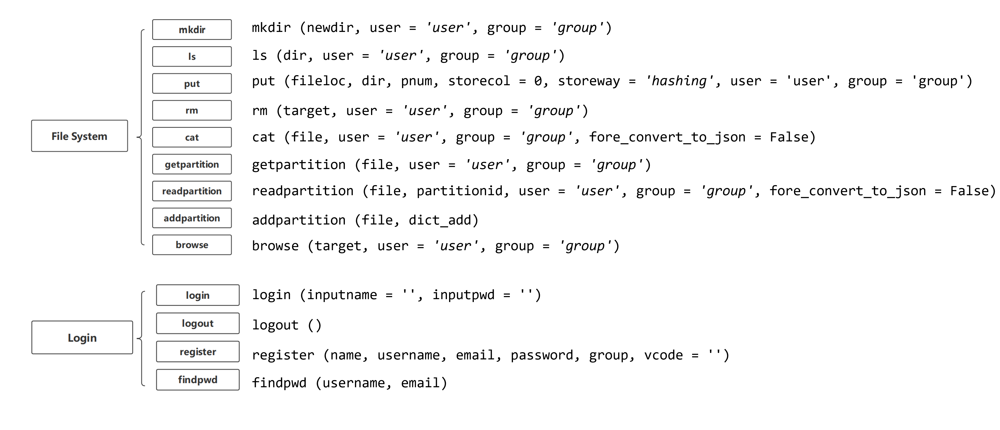
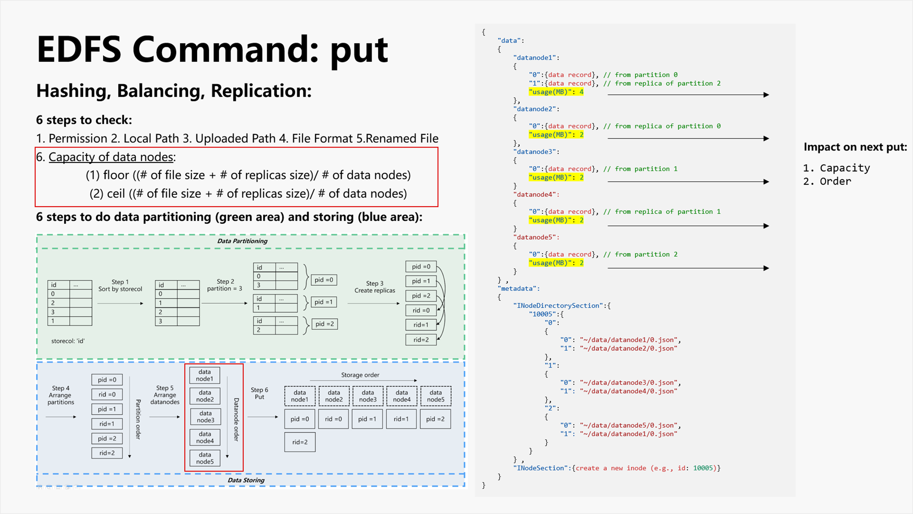
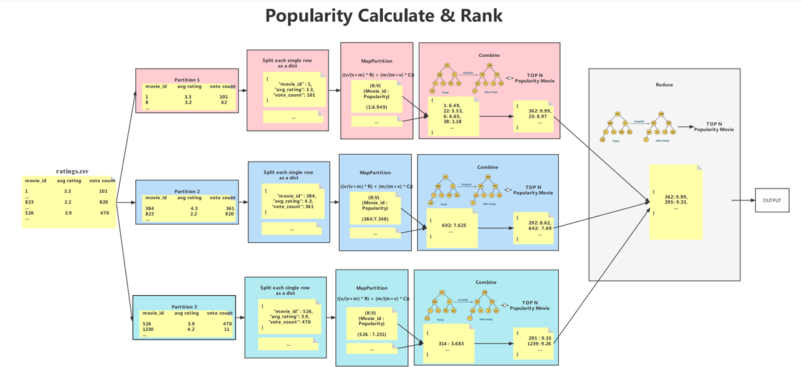
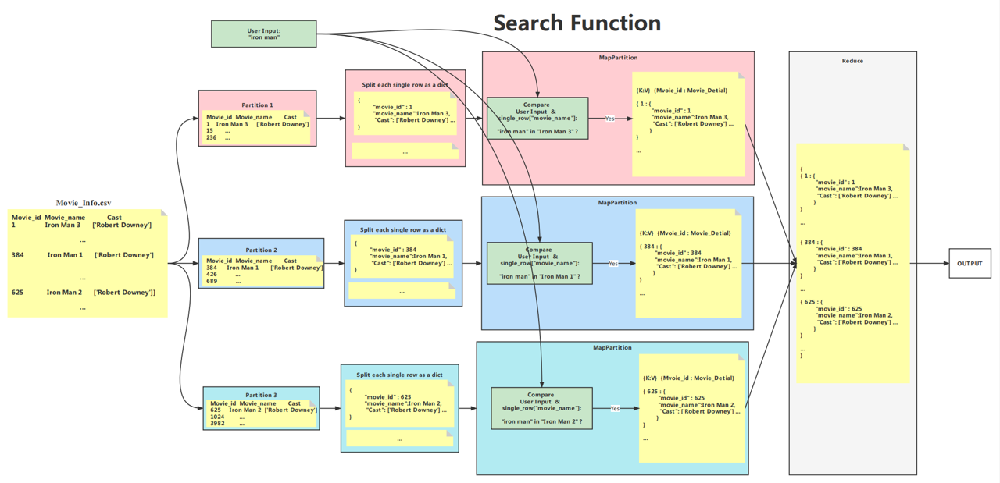
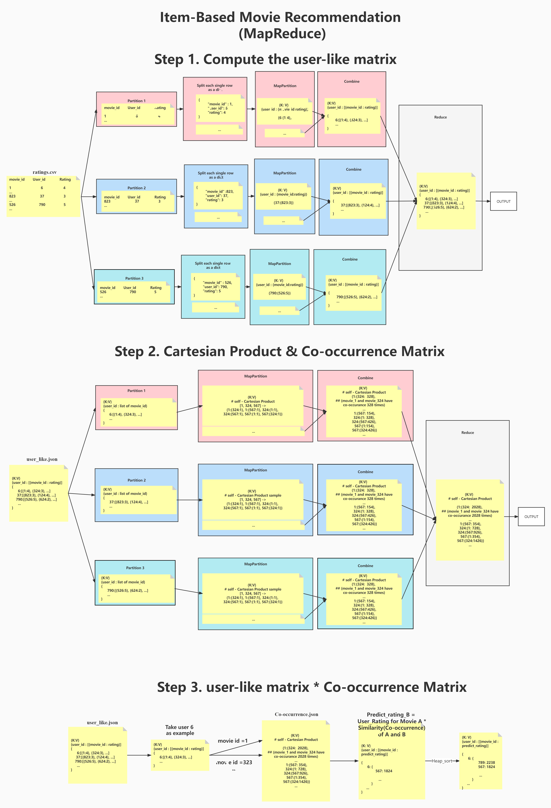
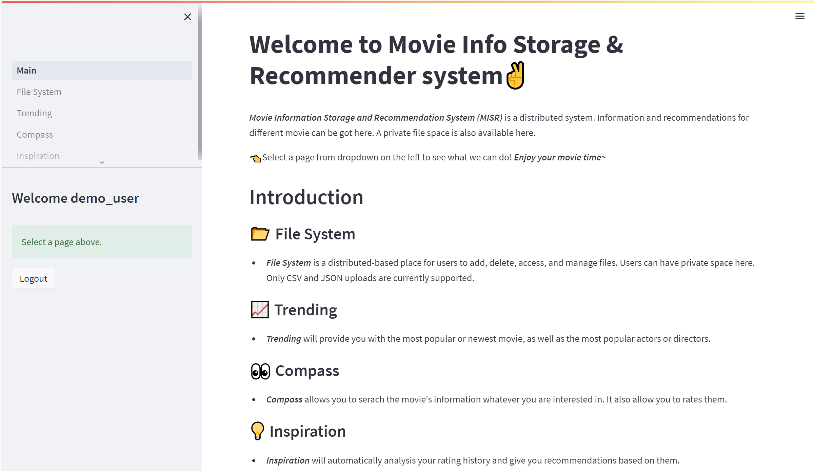
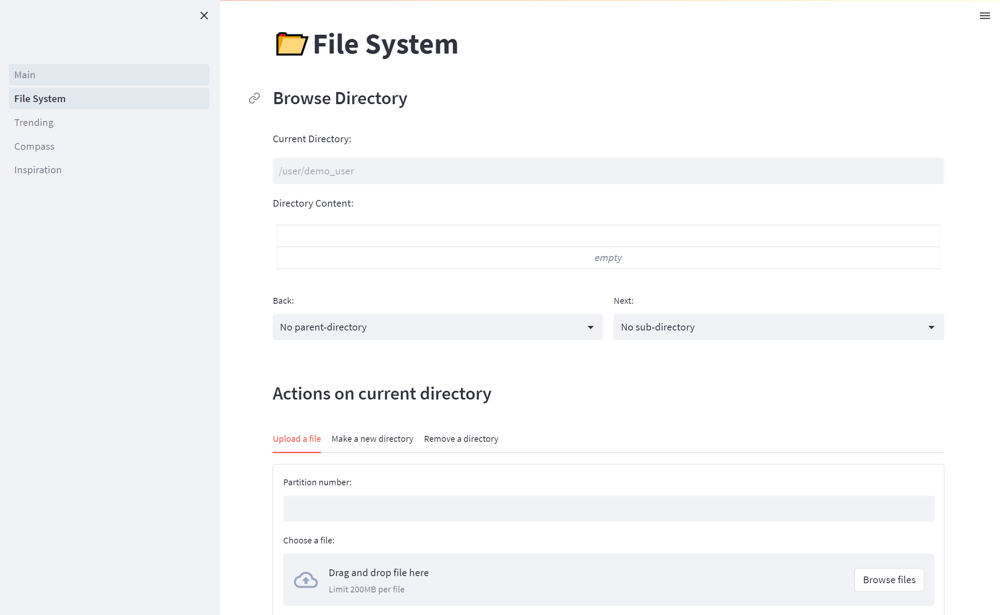
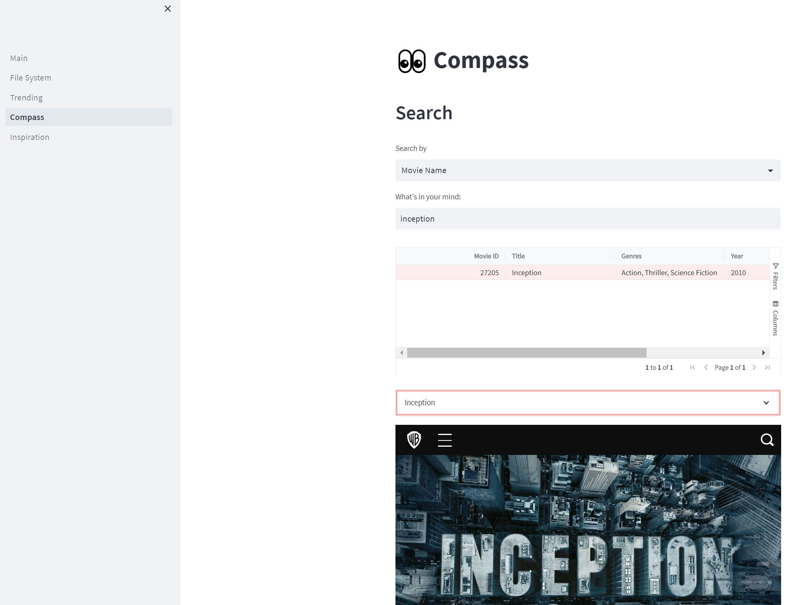

# README
# Movie Info Storage and Recommender System: Emulation-based Distributed File Storage & Parallel Computation

## Introduction
### Welcome to Movie Info Storage and Recommender System! 🍿

The Movie Info Storage and Recommender (MISR) System is an emulation-based system designed for distributed file storage and parallel computation. This system, built on top of Firebase, is equipped to handle extensive movie information and user ratings sourced from Kaggle: The Movie Dataset. It also supports essential file system commands, such as mkdir, ls, put, and readPartition.

Through a user-friendly UI, individuals can seamlessly navigate the system using their accounts and access personalized services accelerated by MapReduce. The offered services encompass functionalities like Search Movie, Get Movie Trends, and Item-based Collaborative Filtering Recommendations.

### Why is it original?

- The MISR system ensures more reliable data storage by leveraging distributed file storage. This approach involves storing replicas across various data nodes, thereby ensuring sustainable access

- The MISR system delivers faster movie recommendations through the implementation of parallel computation. This allows the system to swiftly process extensive datasets and execute recommendation algorithms, providing timely and efficient recommendations to users.

- The MISR system offers a broader range of expansion functions. For instance, users have the flexibility to explore a private distributed file storage space and gain visual insights into current movie trends.

## Getting Started
### Prerequisite:

```bash
# install required packages
pip install streamlit-aggrid
pip install wordcloud
pip install streamlit
pip install pandas

# run the web application
streamlit run Main.py
```
### Testing User:
```bash
# role: admin
username: admin 
password: abc123

# role: user
username: jingqi
password: abc123
```

### Explore More About Our Work
- Demo Video: [Youtube Video](https://www.youtube.com/watch?v=mSjqI0BrIWc)
- Presentation Slide: [Google Slide](https://docs.google.com/presentation/d/1CJP7_qVwgTABZvfFit7KDFGV93zwzDuq/edit?usp=drive_link&ouid=116856484322888255076&rtpof=true&sd=true)

## System Design
### Architecture Design
The MISR system has 4 layers: UI Layer, Service Layer, Data Access Layer, and Data Storage Layer.



### File System Command Design
1. Overview



2. `put` command



### MapReduce Design
1. Trending Movie/ Actor/ Director using MapReduce



2.  Search Function using MapReduce



3. Item-Based Filtering Recommendation using MapReduce



### Feature and Highlights

1. Login Module


2. Welcome Page



3. File System Module



4. Trending Module


5. Compass (Search) Module



6. Inspiration (Recommendation) Module


## System Development
### Built With
- [Kaggle - The Movies Dataset](https://www.kaggle.com/datasets/rounakbanik/the-movies-dataset) for data source
- [Streamlit](https://streamlit.io/) for frontend
- [Python](https://www.python.org/) for backend
- [Firebase Realtime Database](https://firebase.google.com/) for database

### Documentation
- command: implementation code
- kaggle_data_sources: data source
- pages: frontend code
- user_like.json: local user-like matrix
- firebase.py: initialization of firebase